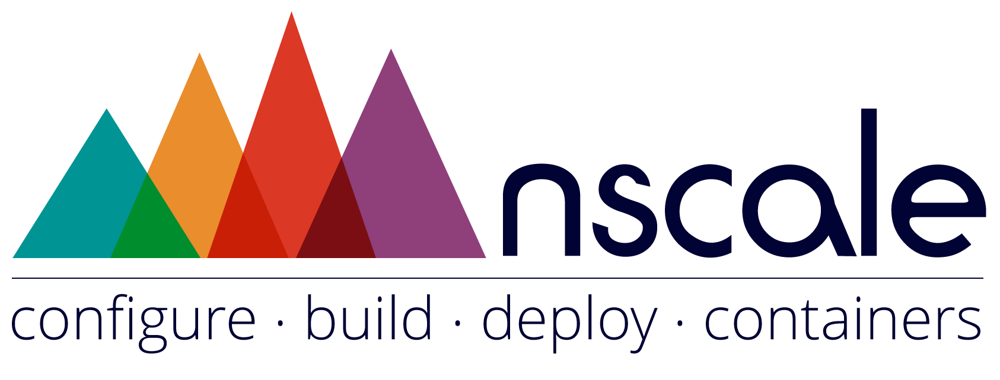

[Back To - Home](../README.md)

# System - CLI Commands

This guide will walk you through each command that can be executed with the nscale CLI.

## help
To list available commands execute `nsd help`:

    $ nsd help

## nsd host

The nsd host is the server running the nsd system.

To set the ndf host execute `nsd use`:

    Usage: nsd use HOST [PORT]

    Example:
    $ nsd use localhost 3223

## login

To authenticate with the nsd host execute `nsd login` and either login by username/password or with your github account.

    Usage: nsd login

### username/password login

    $ nsd login
    prompt: nsd username / password login (y/n): y
    prompt: username: <username>
    prompt: password: <password>

### github login

First generate a new github personal access token in [https://github.com/settings/applications](https://github.com/settings/applications), remembering to select the 'repo' and 'user' scopes.

    $ nsd login
    prompt: nsd username / password login (y/n): n
    prompt: github access token: <personal access token>

## logout

To logout from the nsd host execute `nsd logout`:

    Usage: nsd logout

    Example:
    $ nsd logout

## system

A nsd system is represented by a set of connected containers that are configured, built and deployed to constitute a working platform for distributed applications.

### system create

To create a blank system execute `nsd system create`:

    Usage: nsd system create

    Example:
    $ nsd system create
    prompt: name: <name>
    prompt: namespace: <namespace>
    prompt: confirm (y/n): y

### system clone

To clone a system from an existing git repository execute `nsd system clone`:

    Usage: nsd system clone REPO

    Example:
    $ nsd system clone git@github.com:nearform/nsd-demo

### system sync

To sync a system with its git repository execute `nsd system sync`:

    Usage: nsd system sync NAME

    Example:
    $ nsd system sync nsd-demo

### system list

To list all systems execute `nsd system list`:

    Usage: nsd system list

    Example:
    $ nsd system list

### system put

To update a system with a new revision execute `nsd system put`:

    Usage: nsd system put < FILE

    Example:
    $ nsd system put < nsd-demo.json

### system deployed

To get the deployed revision of a system execute `nsd system deployed`:

    Usage: nsd system deployed NAME

    Example:
    $ nsd system deployed nsd-demo

### system analyze

To run an analysis of a system execute `nsd system analyze`:

    Usage: nsd system analyze NAME

    Example:
    $ nsd system analyze nsd-demo

### system check

To run and verify an analysis of a system execute `nsd system check`:

    Usage: nsd system check NAME

    Example:
    $ nsd system check nsd-demo

## container

A container is a reusable and configurable system resource that can be built and deployed across one or more physical nodes.

The currently supported container types are docker (Docker container), aws-ami (Amazon machine image), aws-sg (Amazon security group), and aws-elb (Amazon load balancer).

### container list

To list all containers of a system execute `nsd container list`:

    Usage: nsd container list NAME

    Example:
    $ nsd container list nsd-demo

### container add

To add a container to a system execute `nsd container add`:

    Usage: nsd container add NAME

    Example:
    $ nsd container add nsd-demo
    prompt: type: docker

### container put

To update a container with a new revision execute `nsd container put`:

    Usage: nsd container put < FILE

    Example:
    $ nsd container put < container.json

### container delete

To delete a container from a system execute `nsd container delete`:

    Usage: nsd container delete NAME CONTAINER

    Example:
    $ nsd container delete nsd-demo web

### container build

To build a container of a system execute `nsd container build`:

    Usage: nsd container build NAME CONTAINER

    Example:
    $ nsd container build nsd-demo web

## Revision

A revision is a recorded system snapshot, automatically saved whenever there are system changes.

### revision list

To list all revisions of a system execute `nsd revision list`:

    Usage: nsd revision list NAME

    Example:
    $ nsd revision list nsd-demo

### revision get

To get a revision of a system execute `nsd revision get`:

    Usage: nsd revision get NAME REVISION

    Example:
    $ nsd revision get nsd-demo 33417ff8f1299c1b35c40b562c5b8310cf66a4cf

### revision deploy

To deploy a revision of a system execute `nsd revision deploy`:

    Usage: nsd revision deploy NAME REVISION

    Example:
    $ nsd revision deploy nsd-demo 33417ff8f1299c1b35c40b562c5b8310cf66a4cf

### revision mark

To mark a revision of a system as being deployed execute `nsd revision mark`:

    Usage: nsd revision mark NAME REVISION

    Example:
    $ nsd revision mark nsd-demo 33417ff8f1299c1b35c40b562c5b8310cf66a4cf

### revision preview

To preview the deploy workflow for a revision of a system execute `nsd revision preview`:

    Usage: nsd revision preview NAME REVISION

    Example:
    $ nsd revision preview nsd-demo 33417ff8f1299c1b35c40b562c5b8310cf66a4cf

## remote add

To add a remote git repository to an existing system execute 'remote add':

    Usage: nsd remote add NAME REPO

    Example:
    $ nsd remote add nsd-demo git@github.com:nearform/nsd-demo

## timeline list

To get the system timeline execute 'timeline list':

    Usage: nsd timeline list NAME

    Example:
    $ nsd timeline list nsd-demo

 
[Back To - Documentation](../README.md)
